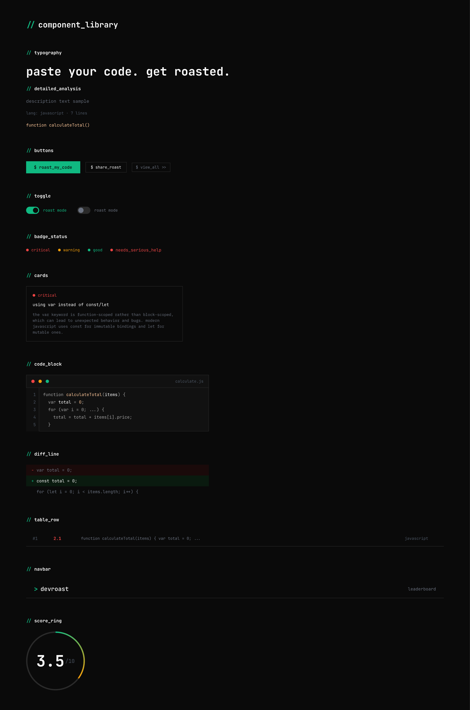

# // devroast

> Cole seu código. Seja detonado.

**DevRoast** é uma aplicação Next.js 16 premium, desenvolvida com foco em estética minimalista, performance e experiência do desenvolvedor. O projeto utiliza um sistema de design exclusivo inspirado em estética mecânica e layouts voltados para código.



## 🚀 Tecnologias

- **Framework**: [Next.js 16](https://nextjs.org/) (App Router + Turbopack)
- **Runtime**: [React 19](https://react.dev/) (React Compiler habilitado)
- **Estilização**: [Tailwind CSS v4](https://tailwindcss.com/)
- **Componentes**: [Base UI](https://base-ui.com/) (Primitivos headless) & [Tailwind Variants](https://cva.style/docs/library-support/tailwind-variants)
- **Linting/Formatação**: [Biome](https://biomejs.dev/)
- **Syntax Highlighting**: [Shiki](https://shiki.style/) (Tema Vesper)
- **Ícones**: [Lucide React](https://lucide.dev/)
- **Tipografia**: [JetBrains Mono](https://www.jetbrains.com/lp/mono/)

## 🎨 Design System

O projeto utiliza um sistema de design documentado em `src/components/ui/AGENTS.md`. Tokens principais:

- **Accent Green**: `#10B981` (Sucesso / Roast Mode)
- **Accent Red**: `#EF4444` (Crítico / Código Removido)
- **Accent Amber**: `#F59E0B` (Aviso / Otimização)
- **Deep Black**: `#0A0A0A` (Cor de fundo da página)

### Componentes Principais

Você pode visualizar todos os componentes no catálogo: `/components`.

- `Button`: Variantes premium (ghost, outline, primary).
- `Switch`: Toggle de estilo mecânico para o "roast mode".
- `CodeBlock`: Syntax highlighting no lado do servidor com Shiki.
- `ScoreRing`: Indicador circular de progresso SVG para notas.
- `DiffLine`: Linhas semânticas de comparação de código.
- `Card`: Containers minimalistas para análise.

## 🛠️ Desenvolvimento

### Instalação

```bash
pnpm install
```

### Servidor de Desenvolvimento

```bash
pnpm dev
```

### Verificações e Formatação

Utilizamos o Biome para garantir a qualidade do código.

```bash
pnpm lint   # Executa o linter
pnpm format # Aplica formatação
pnpm check  # Executa ambos + correções automáticas
```

## 📜 Padrões de Código

Seguimos diretrizes estritas para manter a qualidade:
- **Named Exports**: Sempre prefira `export function` em vez de `default`.
- **TypeScript**: Propriedades nativas estendidas em todos os componentes de UI.
- **Componentes Atômicos**: Peças genéricas residem em `src/components/ui/`.
- **Variáveis Tailwind v4**: Toda a estilização é baseada no tema centralizado em `globals.css`.

---

Desenvolvido com precisão e uma pitada de sarcasmo por **Brenno C. Lins**.
